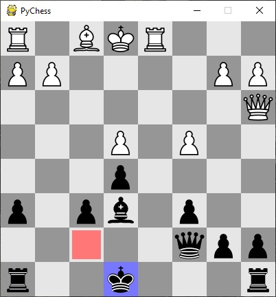
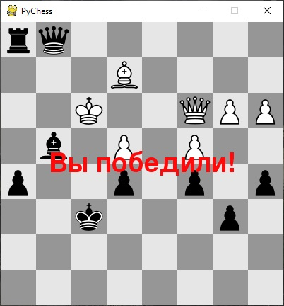
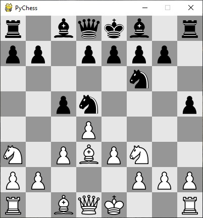
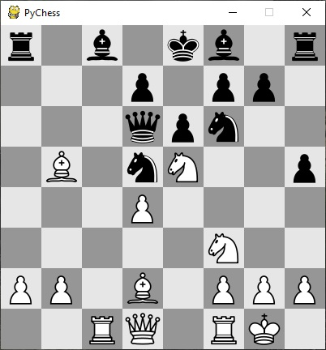
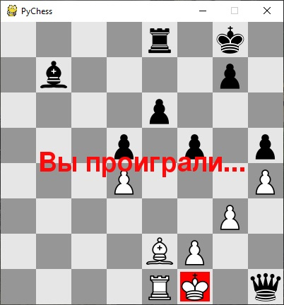

# PyChess

Простая шахматная программа.
Для начала новой партии необходимо запустить файл start_white.pyw (играть белыми) или start_black.pyw (играть черными).
Файлы пакета game_pack:

- game.py
  Функции, входящие в файл необходимы для создания и работы интерфейса. Они отрисовывают доску, фигуры, доступные ходы, сообщения,           выводимые пользователю, принимают и обрабатывают щелчки мышкой.
- params.py
  Параметры игры: цветовые константы, типы ходов, список приоритетов фигур и т.д.
  
- figures.py
  Файл содержит классы, описывающие шахматные фигуры. Все они унаследованы от одного общего класса Figure (в свою очередь унаследованного   от pygame.sprite.Sprite), содержащего код, необходимый для хранения координат фигур и их перерисовки. Каждый класс фигуры, содержит       метод get_actions, который возвращает список клеток, на которые могла бы походить фигура.
  
- boards.py
  Содержит классы, необходимые для представления игрового поля (Board), ходов (Move) и селектора фигур (SelectorBoard), используемого при   выборе фигуры, на которую следует заменить пешку, дошедшую до края поля.
  Самый сложный и функциональный из них - Board. Он представляет игровое поле и действия на нём. Board содержит методы для получения         списка доступных на поле ходов, применения ходов и их отката, а так же оценки текущей позиции. 
  При получении списка доступных ходов учитывается возможность рокировки (как левой, так и правой), взятия пешки на проходе, конверсии       пешки в другую фигуру. Также ходы фильтруются и отбрасываются те, которые ведут к шаху собственному королю (например, ходы, открывающие   удар дальнобойным фигурам противника).
  При получении оценки текущей позиции учитываются относительная сила отдельных фигур (конь ценнее пешки, ферзь ценнее коня), позиция       фигур на доске (слонам предпочтительно занять главные диагонали, коням предпочтительно быть как можно ближе к центру поля и т.д.),         защита своих фигур и атака на чужие (напрмер, чем больше фигур противника находится под ударом, тем сильнее ваша позиция).
  
- ai.py
  В файле содержится код, необходимый для расчета ответного хода компьютера. Использован алгоритм минимакс с отсечением заведомо неудачных   позиций. Для ускорения работы просчет ведется на 4 хода вперед (таким образом, на ответный ход компьютер тратит максимум несколько         секунд на процессоре core i5-2500). Также оптимизирован порядок просчета ходов: вначале оцениваются ходы-взятия, которые заведомо         быстрее ведут к значимым изменениям на доске и быстрее вызывают отсечение.
  
Скриншоты приведены ниже

